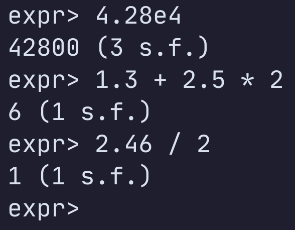

# Significant Figures

## supports

* addition
* subtraction
* multiplication
* division

## coming soon

* constants
* logarithms (`log(base=b, a)`, where `b` is a constant)
* antilogarithms (`a ^ b`, where `a` is a constant)
* exponentiation (`a ^ b`, where `b` is a constant)
